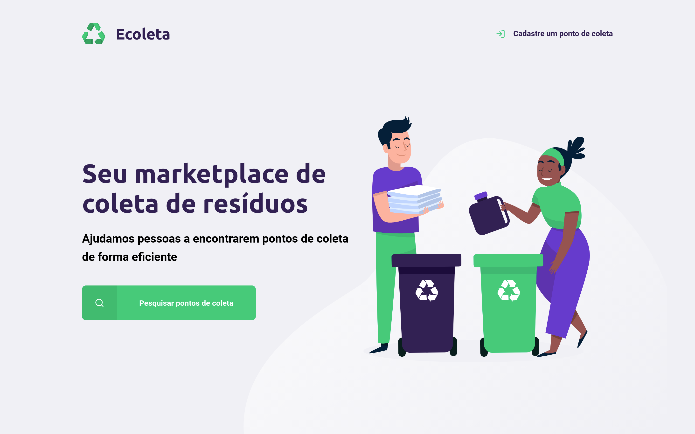
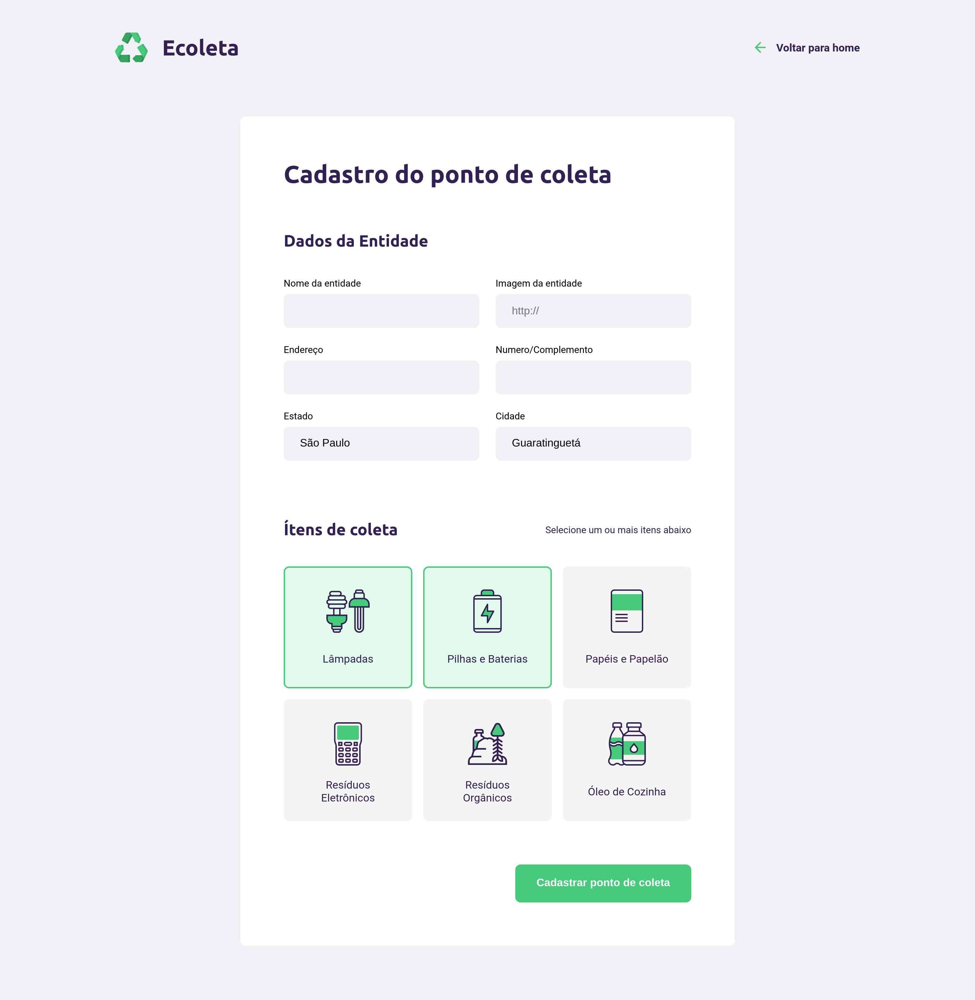
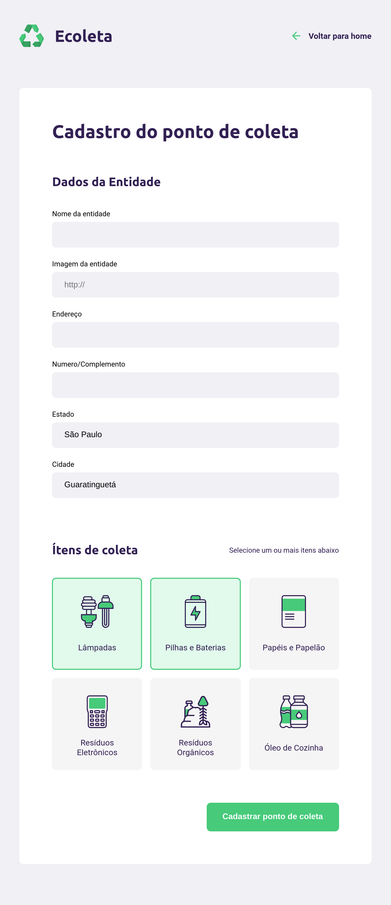
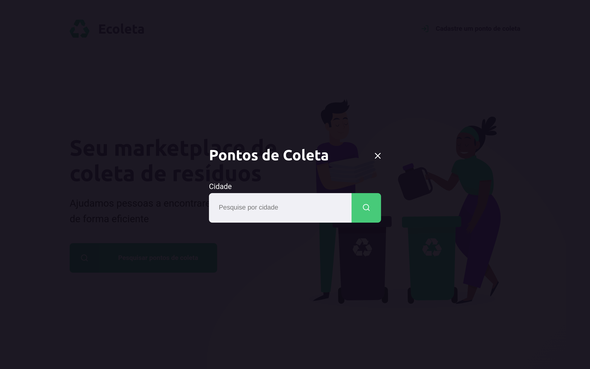
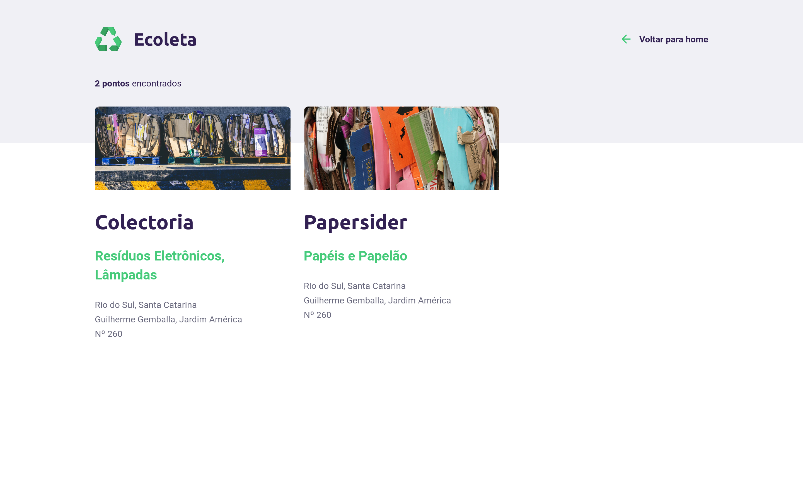
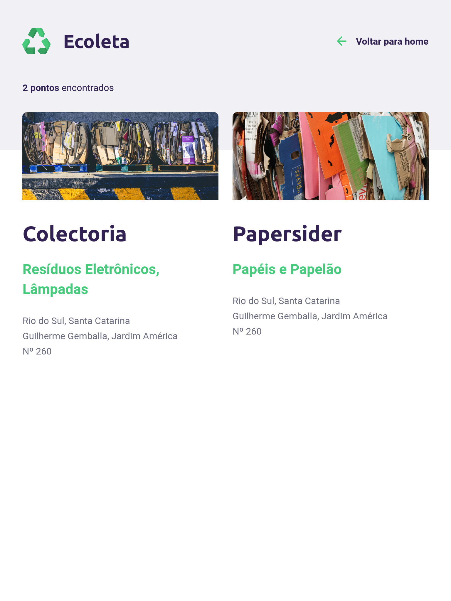

# :recycle: Ecoleta

  <a href="#octocat-o-projeto">O Projeto</a>
  &nbsp;&nbsp;&nbsp;|&nbsp;&nbsp;&nbsp;
  <a href="#computer-tecnologias-utilizadas">Tecnologias utilizadas</a>
  &nbsp;&nbsp;&nbsp;|&nbsp;&nbsp;&nbsp;
  <a href="#calendar-dias-da-semana">Dias da semana</a>
  &nbsp;&nbsp;&nbsp;|&nbsp;&nbsp;&nbsp;
  <a href="#art-design">Design</a>
  &nbsp;&nbsp;&nbsp;|&nbsp;&nbsp;&nbsp;
  <a href="#tv-prints-das-telas-desenvolvidas">Prints</a>

## :octocat: O Projeto
Ecoleta é um site onde ajudamos pessoas a encontrarem pontos de coleta de sua cidade de forma eficiente! Este projeto foi desenvolvido na semana [Next Level Week](https://nextlevelweek.com/) (Starter), feito pela [Rocketseat](https://rocketseat.com.br/) com o instrutor [Mayk Brito](https://github.com/maykbrito). :rocket:

## :computer: Tecnologias utilizadas
- [Express](https://expressjs.com/)
- [Nunjucks](https://mozilla.github.io/nunjucks/)
- [SQLite3](https://www.sqlite.org/index.html)

## :calendar: Dias da semana
- [x] Segunda
- [x] Terça
- [x] Quarta
- [x] Quinta
- [x] Sexta

## :art: Design

Link para o design feito no Figma: [Clique aqui](https://www.figma.com/file/1SxgOMojOB2zYT0Mdk28lB/Ecoleta)

## :tv: Prints das telas desenvolvidas

Assim ficaram as telas já desenvolvidas do projeto.

### Home

***Tela:*** *Home no computador*

***Tela:*** *Home no tablet*

 

### Create Point (Criação de local de coleta)

***Tela:*** *Create Point no computador*

***Tela:*** *Create Point no tablet*

 

### Search

***Tela:*** *Search no computador*

 

### Search Result

***Tela:*** *Search Result no computador*

***Tela:*** *Search Result no tablet*

---

Feito com :heartbeat: